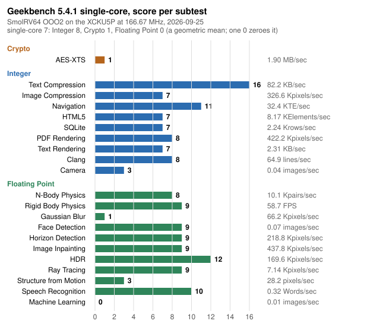

# SmolRV64

SmolRV64 is a 64-bit RISC-V application processor, written from scratch in Verilog, that
boots stock Ubuntu on a Kintex UltraScale+ FPGA at 166.67 MHz and runs Geekbench on it.
The name is a leftover: the project began as a small sequential core, and what ships today
is **OOO2**, a two-wide out-of-order machine with register renaming, four schedulers, a
load queue and a store queue, non-blocking loads, a tagged four-deep FPU pipeline, and a
memory system that lets the Linux kernel run non-coherent virtio DMA without a coherent
fabric. Every committed instruction is checked in lockstep against an independent ISA
model, and every non-trivial change has to boot Ubuntu to a login prompt on the board with
zero faults before it lands.



| | |
|---|---|
| Geekbench 5.4.1 single-core, board, 2026-09-07 | **5** (Integer 5, Crypto 1, Floating Point 0); the whole suite in 5 h 35 min at IPC 0.40, against 9 h 05 min at IPC 0.26 two weeks earlier and a score of 0.9 for the sequential core in June ([result 24610038](https://browser.geekbench.com/v5/cpu/24610038)) |
| `sha256sum` of a 30 MB file, board | IPC 1.32 to 1.39 |
| Clock | 166.67 MHz on the XCKU5P (a 6.000 ns cycle), closed with dynamic issue and two-wide dispatch; DDR4 at 333 MHz |
| Area | 82,540 LUTs (38% of the part), 49,498 flip-flops, 122 of 480 block RAM tiles, 28 DSPs, no UltraRAM |
| Software | OpenSBI, mainline Linux, Ubuntu 25.04 over an NFS root through the core's own virtio-net; Geekbench 5, 6 and 7 installed on it |

**Why three bars are so short.** Gaussian Blur, Structure from Motion and Machine
Learning score 1, 2 and 0, and Machine Learning's 0.01 images per second has not moved
since June while every other subtest moved four to ten times. Its counter trace says why:
IPC 0.36, no trap storm, a 4.4% data-cache miss rate, and about six billion scalar
instructions per image. Geekbench's reference machine does that work with SIMD; this core
has no vector extension, so it executes the scalar fallback instruction by instruction, and
no amount of IPC work reaches those three scores. Geekbench's Floating Point figure is a
geometric mean, so the one zero zeroes it. A vector unit is the only lever on them, and
whether one fits without giving up the clock is an open question below.

## Why it is interesting

**A real out-of-order core sized for an FPGA.** OOO2 is what an R10000-style machine looks
like when every structure is chosen by what a Kintex LUT, LUTRAM or block RAM does well
(docs/OOO2-Spec.md is the normative description, and every number below is read off the
RTL or measured with the workload named):

- **Two-wide fetch, dispatch and retire.** A 16-byte fetch window over a three-chunk
  run-ahead fetch buffer with two I$ requests in flight; an aligner that emits up to two
  RVC or 32-bit instructions per cycle into an 8-entry decoupling queue; two ROB entries
  allocated and up to two retired per cycle.
- **A status-only reorder buffer.** 16 entries of 16 bits each: no values, no PCs, no
  operands. A second, *irrevocable* pointer walks ahead of the head over completed entries
  and commits stores early, so a store never holds retirement for the cache's write.
  Squash is pointer-only; there is nothing to walk.
- **A unified physical register file in four shards, one writer each.** Duplication buys
  read ports; sharding by writer is what buys write ports. Each shard has exactly one
  writer (ALU A, ALU B, everything stage M completes, the FPU), so there is no write
  arbitration anywhere and the integer scheduler carries no unit-busy term at all. Taking a
  second writer off one shard was worth 0.4 ns of cycle time.
- **Four schedulers, no age matrix.** Two integer schedulers (one per ALU), one in-order
  memory scheduler and one FP scheduler, each with fixed-priority select and
  wake-at-select, so a dependent issues the cycle after its producer. Entries hold only
  physical register tags and ready bits; the execute payload sits in a separate LUTRAM
  indexed by scheduler entry, never by ROB slot.
- **Rename with one-cycle rollback.** Speculative and committed maps, per-shard free lists
  with a speculative and a committed head; recovery is `head := committed head`, with no
  walk, because rename never writes the free-list array.
- **Loads that leave the pipeline.** A plain load or store only *translates* in stage M
  and leaves; the load queue and the store queue reach memory later through one
  pre-translated port, the store winning. A load with no older store in the queue starts
  its access in the same cycle; the queue holds a load behind an older store only when the
  addresses may alias. The store queue is senior to retirement: a committed store's ROB
  slot retires while its bytes drain behind it, and a redirect flushes only the
  uncommitted tail.
- **A tagged, four-deep FPU.** CVFPU (fpnew) with four operations in flight, results
  returned by tag and out of order, and its own scheduler and execute stage, so FP
  arithmetic never enters the memory stage and cannot block it. Reordering the FP issue
  took a Geekbench Gaussian Blur kernel from 39.5 to 29.4 cycles per pixel.
- **Prediction a cycle ahead.** The BTB (1024 entries), a YAGS corrector (1024 entries), a
  12-bit global history, an 8-entry return stack and a length predictor are read from a
  register-only *ahead* PC, so the whole prediction loop has a full cycle of slack. Neither
  array has a valid bit: validity is the tag match, which is what let both live in block
  RAM. Prediction is keyed by the bundle base and trained from the resolving branch's
  offset within it, so two-wide fetch cost no prediction accuracy.
- **Caches built from what the part has.** 64 KB two-way skew-associative PIPT
  instruction and data caches with 64-byte lines in even/odd 64-bit block-RAM banks, so any
  read at any byte offset spans at most two banks and needs no wide multiplexer. The data
  cache is write-back with a lookup pipeline and a separate fill machine: a plain read
  overlaps a fill, a write is accepted under a fill and a write miss is completed by the
  fill machine, and the cache's door is open in a write's last cycle so stores stream at
  one per two cycles. Page-table walks run as line requesters through the same L2 arbiter.
- **Virtual memory as Linux expects it.** Sv39 with hardware page-table walkers, two
  16-entry TLBs, superpages, Ssvnapot leaves, Svpbmt non-cacheable mappings plus Zicbom
  and Zicboz cache-management operations, so the kernel drives non-coherent virtio DMA
  rings with its standard machinery. Misaligned loads and stores are handled in hardware,
  including across cache lines. The MMU range-checks every resolved physical address and
  faults rather than dropping the access.
- **Interrupts through the trap path.** An external or timer interrupt is injected as a
  pseudo-op that traps in stage M, so traps, faults and interrupts share one precise
  mechanism; a pending interrupt waits out a page-straddling fetch rather than abandoning
  it.

**An SoC that runs the real thing.** CLINT, PLIC, an NS16550A UART hardwired to 3 Mbaud,
virtio-blk backed by an SD card over SPI, virtio-net over RGMII with an eight-slot receive
ring and word-wide DMA, a 256 KiB boot SRAM holding a ROM monitor with XMODEM upload and a
memory-integrity command set, and one 512-bit line port into DDR4 with a hardware latency
monitor on it. Ubuntu boots to `login:` over an NFS root; the board has run for days at a
time.

**Verification that is part of the design.**

- **Lockstep cosimulation against [Simmerv](https://github.com/tommythorn/simmerv).** A DPI
  bridge hands every retiring instruction to the ISA model and compares PC, destination,
  value, privilege, traps and memory effects. It runs the tiny128 Linux boot (300 million
  cycles is the required length), the Geekbench image's kernel boot (over 400 million),
  a glibc userspace harness (ld.so, dash, coreutils, four iterations of a checksum), and
  systemd's own loader through 20 shared libraries, because the defects that reached the
  board were all in code the small boot never ran.
- **151 always-on invariants.** Every "this cannot happen" in the core is a `$fatal`, never
  an `ifdef`: tagged responses matched to their requester, a load never starting while the
  live alias check holds it, the scheduler's payload compared against the pipeline every
  cycle, the two ROB pointers never crossing. Detection latency, not defect rate, is what
  costs days.
- **A lint gate with teeth.** Width truncation, incomplete case, latches, combinational
  loops, undriven and multiply-driven nets, missing pins: all errors, with waivers that must
  name a file. A generated perf-event file and the device tree's timebase are checked in
  the same gate, because each had drifted once.
- **Unit benches** for the cache (directed, at four memory latencies), the load and store
  queues together (85 directed checks plus a constrained-random program-order model), the
  scheduler, the CBO-behind-stores hang, the virtio-net DMA at every alignment and the
  Ethernet receive engine across two clocks; 240 riscv-tests under Verilator with the real
  FPU.
- **Netlist and RAM checks.** The post-synthesis netlist boots the ROM monitor under xsim
  before a bitstream is built, and a manifest of arrays that must infer as RAM fails the
  build if one comes back as flops. Both exist because Vivado once folded a rename read
  port to zero on four bitstreams that every simulation passed.
- **The board is the last gate.** `tools/gate.sh` builds at the shipping configuration,
  programs the board, boots Ubuntu and passes only on `login:` with zero kernel or
  userspace faults; the evidence is banked per commit.
- **The rules are written down.** [docs/rtl-rules.md](docs/rtl-rules.md) derives every
  rule from the project's own defect record, with the commit that paid for it.

**Observability on hardware.** 33 performance events through 13 `mhpmcounter`s, exposed to
Linux `perf` by a generated event file. The counters charge every non-retiring cycle to
exactly one cause, so a `perf stat` run turns into a CPI stack: issue floor, LSU, FPU,
multiplier and divider, serialization, dispatch holds by cause, ROB full, the mispredict
drain, and the frontend broken down into I-cache, iTLB, alignment and queue. The same
counters, sampled every 10 s across a Geekbench run, give a stack per subtest.

## Performance

Geekbench 5 on the board is the target metric; the whole-run IPC from `perf stat` is the
comparable number across builds, and the subtest rates are what the scores follow.

| date | core | clock | whole suite | IPC | single-core score |
|---|---|---|---|---|---|
| 2026-06-26 | the sequential core | 66.67 MHz | | | 0.9 (after the timer correction) |
| 2026-08-17 | OOO2 as an in-order pipeline | 111.11 MHz | 25.4 h | | Integer 0 |
| 2026-08-28 | dynamic issue, one-wide | 166.67 MHz | 9 h 05 min | 0.26 | |
| 2026-09-07 | two-wide, the full stack | 166.67 MHz | 5 h 35 min | 0.40 | **5** |

The CPI stack of the 2026-09-07 run: 2.49 cycles per instruction, of which 0.50 is the
two-wide issue floor, 1.18 the load/store unit, 0.48 the FPU, 0.16 serializing operations,
0.05 multiply and divide and 0.10 the frontend. Geekbench is now bound by the data-side
hit latency; the frontend is 4% of cycles. Text Compression and Navigation score 10; Clang
and SQLite, which spend over 20% of their cycles in the frontend on some 40 redirects per
thousand instructions, are where a better predictor would pay next; the three SIMD-shaped
subtests are the ISA's, as explained above.

The plan that produced this, with every item justified by a measurement on this core,
is [docs/PLAN-2026-09-05-ipc.md](docs/PLAN-2026-09-05-ipc.md). Geekbench 6 and SPEC
results will be added as they are run.

## Quick start

```
git clone --recursive https://github.com/tommythorn/smolrv64
cd smolrv64
src/lint.sh                                   # lint: clean
ooo2/run-ooo2-vl.sh                           # riscv-tests under Verilator: pass=240 fail=0
for t in ooo2/run-ooo2-*-tb.sh; do $t; done   # the core's unit benches
src/run-tb.sh                                 # the shared blocks' and devices' benches
ooo2/run-ooo2-linux.sh                        # boot Linux (tiny128 initramfs) under Verilator
CYC=300000000 ooo2/run-ooo2-cosim-linux.sh    # the same boot in lockstep with simmerv
```

The lockstep runs need a [Simmerv](https://github.com/tommythorn/simmerv) checkout at
`~/simmerv` (or `SIMMERV_DIR`) built with its cosim library. Verilator 5.x and Icarus
Verilog are the simulators; the cross toolchain is `riscv64-linux-gnu-gcc`.

The FPGA flow is headless Vivado 2025.1 in `platforms/rk-xcku5p-f-v1.2/`:

```
make -C platforms/rk-xcku5p-f-v1.2            # synth + impl + bitstream at the shipping configuration
make -C platforms/rk-xcku5p-f-v1.2 program    # program the board over JTAG
make -C platforms/rk-xcku5p-f-v1.2 timing     # the routed checkpoint's worst paths
make -C platforms/rk-xcku5p-f-v1.2 census     # every near-critical endpoint, grouped into families
tools/gate.sh                                 # build, program, boot Ubuntu to login:, judge
```

The board boots through the ROM monitor: `workloads/ubuntu/ubuntu-boot.sh` uploads the
device tree and the OpenSBI+Linux payload over the serial console at 3 Mbaud and starts
them; the root filesystem is served over NFS. On the board, `tools/perf-smol.sh cpi <cmd>`
runs a command under an event set that fits the counters and `tools/perf-cpi-stack.py`
turns the output into a CPI stack.

## Repository layout

| Path | Contents |
|---|---|
| `ooo2/` | The core and its SoC top (`rv_soc_top.v`), the caches and L2 arbiter, the core's testbenches and run scripts |
| `src/` | The blocks the core shares (fetch, aligner, decode, ALU, MMU, CSRs, the FPU wrapper), the SoC devices (CLINT, PLIC, UART, virtio, Ethernet, SD, the DDR line bridge), their benches, the lint gate, the cosim DPI |
| `platforms/rk-xcku5p-f-v1.2/` | The FPGA build: top level, constraints, the scripted Vivado flow, the timing and utilization reports, the ILA debug cores |
| `tools/` | The gate, the netlist boot, the RAM and function-read checks, the perf event sets and CPI stack, the Geekbench trace and chart tools, the frontend and predictor models |
| `workloads/` | The Linux images and device trees (tiny128, Ubuntu over NFS, Geekbench), the glibc and systemd cosim harnesses, the ROM monitor, the bare-metal microbenchmarks |
| `tests/` | riscv-tests binaries |
| `docs/` | `OOO2-Spec.md` (normative), `rtl-rules.md`, the current plans, `history/` with the dated records of how the core got here |
| `third_party/cvfpu` | CVFPU (fpnew), as a submodule |

## What comes next

- The ROB at 32 entries (built on a branch; the 16-entry window is not the measured
  limiter, so it waits for a measurement that says otherwise).
- Store-to-load forwarding for stack-heavy code such as Clang, now that the store queue
  exists to hold it.
- The data-cache next-line prefetcher, built and measured in simulation (+34% on the
  kernel's memory init) but off because it faults under real DMA on the board.
- An L2 in UltraRAM, which the part has 64 blocks of and the design uses none of.
- Beyond two-wide: a predecoded packet cache and a fetch-target queue
  (`wip/fe-ideas`), and the question of whether a vector unit fits without giving up the
  clock.
- Geekbench 6 and SPEC CPU on the board.

## Licensing

SmolRV64 is released under the **Apache License, Version 2.0**. See [LICENSE](LICENSE)
for the full text and [NOTICE](NOTICE) for copyright and third-party attribution.

The floating-point unit in [`third_party/cvfpu`](third_party/cvfpu) (CVFPU / FPnew, ETH
Zurich and University of Bologna) is released under the *SolderPad Hardware License,
version 0.51*, a permissive license based on Apache 2.0 that expressly permits the licensee
to treat the work as licensed under Apache 2.0. The T-Head E906 and C910 DivSqrt units
vendored within CVFPU are released under Apache 2.0 directly.
