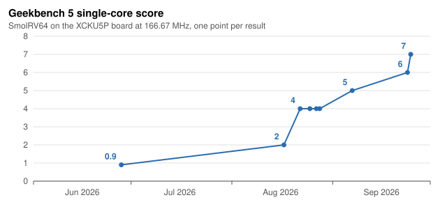

# SmolRV64



SmolRV64 is a 64-bit RISC-V application processor, written from scratch in Verilog, that
boots stock Ubuntu on a Kintex UltraScale+ FPGA at 166.67 MHz and runs Geekbench on it.
The name is a leftover: the project began as a small sequential core, and what ships today
is **OOO2**, a three-wide out-of-order machine with register renaming, a decoupled fetch
stream over a virtually tagged instruction cache, four schedulers, a load queue and a senior
store queue, non-blocking tagged loads, a tagged four-deep FPU pipeline, and a memory system
that lets the Linux kernel run non-coherent virtio DMA without a coherent fabric. Every committed instruction is checked in lockstep against an independent ISA
model, and every non-trivial change has to boot Ubuntu to a login prompt on the board with
zero faults before it lands.


| | |
|---|---|
| Geekbench 5.4.1, board, 2026-09-25 | **7** single-core (Integer 8, Crypto 1, Floating Point 0), 6 multi-core; the whole suite in 4 h 17 min at IPC 0.51, against 5 h 35 min at IPC 0.40 on 2026-09-07 and a score of 0.9 for the sequential core in June ([result 24664943](https://browser.geekbench.com/v5/cpu/24664943)) |
| Geekbench 6.7.1, board, 2026-09-21 to 23 | 4 single-core, 4 multi-core ([result 19246188](https://browser.geekbench.com/v6/cpu/19246188)) |
| `sha256sum` of a 30 MB file, board | IPC 1.32 to 1.39 |
| Clock | 166.67 MHz on the XCKU5P (a 6.000 ns cycle), closed three-wide; DDR4 at 333 MHz |
| Area | 96,664 LUTs (45% of the part), 53,442 flip-flops, 129 of 480 block RAM tiles, 28 DSPs, no UltraRAM |
| Software | OpenSBI and mainline Linux; Ubuntu 25.04 boots over an NFS root through the core's own virtio-net |

**Why three bars are so short.** Gaussian Blur, Structure from Motion and Machine
Learning score 1, 3 and 0, and Machine Learning's 0.01 images per second has not moved
since June while the other subtests have moved several times over. Its counter trace says why:
IPC 0.36, no trap storm, a 4.4% data-cache miss rate, and about six billion scalar
instructions per image. Geekbench's reference machine does that work with SIMD; this core
has no vector extension, so it executes the scalar fallback instruction by instruction, and
no amount of IPC work reaches those three scores. Geekbench's Floating Point figure is a
geometric mean, so the one zero zeroes it. A vector unit is the only lever on them, and
whether one fits without giving up the clock is an open question below.

## Why it is interesting

**A real out-of-order core sized for an FPGA.** OOO2 is what an R10000-style machine looks
like when every structure is chosen by what a Kintex LUT, LUTRAM or block RAM does well
(docs/OOO2-Spec.md is the normative description, and every number below is read off the
RTL or measured with the workload named):

- **Three-wide dispatch and retire behind a decoupled fetch stream.** The fetch stream
  reads one 16-byte pair per cycle from the instruction cache into a fetch ring, ahead of
  decode; an aligner emits up to three RVC or 32-bit instructions per cycle into an 8-entry
  decoupling queue; three ROB entries are allocated and up to three retired per cycle.
- **A status-only reorder buffer.** 32 entries of 17 bits each: no values, no PCs, no
  operands. A second, *irrevocable* pointer walks ahead of the head over completed entries
  and commits stores early, so a store never holds retirement for the cache's write.
  Squash is pointer-only; there is nothing to walk.
- **A unified physical register file in four shards, one write port each.** Duplication
  buys read ports; sharding by writer is what buys write ports. Each ALU owns a shard
  alone; loads and the system queue share one, and the FP stage (the FPU and the one-cycle
  FP operations beside it), the multiply/divide stage and the jump link share the last,
  taking turns through one yield gate. So the integer
  schedulers carry no unit-busy term at all. Taking a second writer off one shard was worth
  0.4 ns of cycle time.
- **Four schedulers, no age matrix.** Two integer schedulers (one per ALU), one in-order
  memory scheduler, and one for FP arithmetic, branches, jumps, multiplies and divides that
  reorders them freely. Each has fixed-priority select and wake-at-select, so a dependent
  issues the cycle after its producer. Entries hold only
  physical register tags and ready bits; the execute payload sits in a separate LUTRAM
  indexed by scheduler entry, never by ROB slot.
- **Rename with one-cycle rollback.** Speculative and committed maps, per-shard free lists
  with a speculative and a committed head; recovery is `head := committed head`, with no
  walk, because rename never writes the free-list array.
- **Loads that leave the pipeline.** A plain load or store only *translates* in stage M
  and leaves; the load queue and the store queue reach memory later through one
  pre-translated port, the store winning. A load with no older store in the queue starts
  its access in the same cycle; the queue holds a load behind an older store only when the
  addresses may alias. Up to eight loads are in flight to the data cache at once, matched
  by the load-queue tag they carry. The store queue is senior to retirement: a committed
  store's ROB slot retires while its bytes drain behind it, and a redirect flushes only the
  uncommitted tail.
- **System operations at the head, from flops.** CSR accesses, fences and the traps decided
  at dispatch (illegal instructions, fetch faults) wait in a one-entry system queue and fire
  when they reach the ROB head, from registers, so none of them sits in the memory stage's
  completion path; the memory stage holds only loads, stores, AMOs and cache operations.
  Multiplies and divides run in their own stage and land by tag.
- **A tagged, four-deep FPU.** CVFPU (fpnew) with four operations in flight, results
  returned by tag and out of order, and its own scheduler and execute stage, so FP
  arithmetic never enters the memory stage and cannot block it. Reordering the FP issue
  took a Geekbench Gaussian Blur kernel from 39.5 to 29.4 cycles per pixel.
- **Prediction at the fetch stream.** A 2048-entry BTB and a 2048-entry YAGS corrector in
  eight block-RAM banks, an 11-bit global history carried with each instruction, and an
  8-entry return stack predict each 16-byte pair as it is fetched, keyed by a
  control-transfer instruction's last halfword; an 8-entry prediction queue carries each
  prediction's state to the instruction it names. Neither table has a valid bit: validity
  is the tag match.
- **Caches built from what the part has.** A 64 KB two-way instruction cache that is
  virtually indexed and hits on its virtual tag and an epoch, reconciling by physical tag
  only on a miss, so fetch needs no translation per access; it reads a 16-byte pair every
  cycle. A 64 KB two-way skew-associative physically tagged data cache, write-back, with a
  lookup pipeline and a separate fill machine: a plain read overlaps a fill, a write is
  accepted under a fill and a write miss is completed by the fill machine, the door takes a
  read every cycle, and stores stream at one per two cycles. Both use 64-byte lines in even/odd 64-bit block-RAM banks.
  Page-table walks read through the data cache, so a walk always sees dirty page-table
  entries.
- **Virtual memory as Linux expects it.** Sv39 with hardware page-table walkers, two
  16-entry TLBs, superpages, Ssvnapot leaves, Svpbmt non-cacheable mappings plus Zicbom
  and Zicboz cache-management operations, so the kernel drives non-coherent virtio DMA
  rings with its standard machinery. Misaligned loads and stores are handled in hardware,
  including across cache lines. The physical address space is 36 bits, capped at the
  instance's top of DRAM: the MMU range-checks every resolved physical address and faults
  rather than dropping the access.
- **Interrupts through the trap path.** An external or timer interrupt is injected as a
  pseudo-op that traps in stage M, so traps, faults and interrupts share one precise
  mechanism; a pending interrupt waits out a page-straddling fetch rather than abandoning
  it.

**An SoC that runs the real thing.** CLINT, PLIC, an NS16550A UART hardwired to 3 Mbaud,
virtio-blk backed by an SD card over SPI, virtio-net over RGMII with an eight-slot receive
ring and word-wide DMA, a 256 KiB boot SRAM holding a ROM monitor with XMODEM upload and a
memory-integrity command set, and one 512-bit line port into DDR4 with a hardware latency
monitor on it. Ubuntu boots to `login:` over an NFS root; the board has run for days at a
time.

**Verification that is part of the design.**

- **Lockstep cosimulation against [Simmerv](https://github.com/tommythorn/simmerv).** A DPI
  bridge hands every retiring instruction to the ISA model and compares PC, destination,
  value, privilege, traps and memory effects. It runs the tiny128 Linux boot (300 million
  cycles is the required length), the Geekbench image's kernel boot (over 400 million),
  a glibc userspace harness (ld.so, dash, coreutils, four iterations of a checksum), and
  systemd's own loader through 20 shared libraries, because the defects that reached the
  board were all in code the small boot never ran.
- **218 always-on invariants.** Every "this cannot happen" in the RTL is a `$fatal`, never
  an `ifdef`: tagged responses matched to their requester, a load never starting while the
  live alias check holds it, the scheduler's payload compared against the pipeline every
  cycle, the two ROB pointers never crossing, nothing that changes memory started off the
  ROB head. Detection latency, not defect rate, is what costs days.
- **The same invariants on the board.** An integrity log latches the caches', the LSU's and
  the frontend's invariants into sticky hardware bits, with the first one's cycle; Linux
  reads it back after every board run, and a nonzero log fails the gate however clean the
  console looked.
- **Random programs in lockstep.** `workloads/memrand` generates random streams of loads,
  stores, AMOs, LR/SC, FP, CBOs, fences, page remaps over aliased mappings and wrong-path
  memory operations, with a DMA agent interrupting through the PLIC, and judges every load
  and store byte against the ISA model.
- **A lint gate with teeth.** Width truncation, incomplete case, latches, combinational
  loops, undriven and multiply-driven nets, missing pins: all errors, with waivers that must
  name a file. A generated perf-event file and the device tree's timebase are checked in
  the same gate, because each had drifted once.
- **Unit benches** for the data cache (directed, at four memory latencies), the
  instruction cache (random remaps and fence.i against a byte image), the load and store
  queues together (85 directed checks plus a constrained-random program-order model), the
  scheduler, the CBO-behind-stores hang, the virtio-net DMA at every alignment and the
  Ethernet receive engine across two clocks; 240 riscv-tests under Verilator with the real
  FPU.
- **Netlist and RAM checks.** The post-synthesis netlist boots the ROM monitor under xsim
  before a bitstream is built, and a manifest of arrays that must infer as RAM fails the
  build if one comes back as flops. Both exist because Vivado once folded a rename read
  port to zero on four bitstreams that every simulation passed.
- **The board is the last gate.** `tools/gate.sh` builds at the shipping configuration,
  programs the board, boots Ubuntu and passes only on `login:` with zero kernel or
  userspace faults; the evidence is banked per commit.
- **The rules are written down.** [docs/rtl-rules.md](docs/rtl-rules.md) derives every
  rule from the project's own defect record, with the commit that paid for it.

**Observability on hardware.** 43 performance events through 13 `mhpmcounter`s, exposed to
Linux `perf` by a generated event file. The counters charge every non-retiring cycle to
exactly one cause, so a `perf stat` run turns into a CPI stack: issue floor, LSU, FPU,
multiplier and divider, serialization, dispatch holds by cause, ROB full, the mispredict
drain, and the frontend broken down into I-cache, iTLB, alignment and queue. The same
counters, sampled every 10 s across a Geekbench run, give a stack per subtest.

## Performance

Geekbench 5 on the board is the target metric; the whole-run IPC from `perf stat` is the
comparable number across builds, and the subtest rates are what the scores follow.

| date | core | clock | whole suite | IPC | single-core score |
|---|---|---|---|---|---|
| 2026-06-26 | the sequential core | 66.67 MHz | | | 0.9 (after the timer correction) |
| 2026-08-17 | OOO2 as an in-order pipeline | 111.11 MHz | 25.4 h | | Integer 0 |
| 2026-08-28 | dynamic issue, one-wide | 166.67 MHz | 9 h 05 min | 0.26 | |
| 2026-09-07 | two-wide, the full stack | 166.67 MHz | 5 h 35 min | 0.40 | 5 |
| 2026-09-24 | three-wide, 36-bit physical addresses | 166.67 MHz | 4 h 34 min | 0.49 | 6 |
| 2026-09-25 | + the decoupled fetch stream, the VHPR instruction cache | 166.67 MHz | 4 h 24 min | 0.50 | 7 |
| 2026-09-25 | + an 8-entry load queue, a data-cache read every cycle, an empty memory stage | 166.67 MHz | 4 h 17 min | 0.51 | **7** |

Geekbench 6.7.1 on 27f03a7f, three-wide ([result 19246188](https://browser.geekbench.com/v6/cpu/19246188),
2026-09-21 to 23): 4 single-core, 4 multi-core. Geekbench 6 is more load-bound than
Geekbench 5 and multiplies far more.

The CPI stack of the latest Geekbench 5 run (0790196c): 1.94 cycles per instruction.
Charged per cycle, with overlap where two units block at once, the load/store unit holds
up 52% of cycles, the FPU 25%, a full ROB 30%, dispatch holds 7%, the multiplier 2% and
the frontend 5.5%, 3% of it waiting on the instruction cache. The data cache misses 8.2
times per thousand instructions, and there are 3.3 redirects per thousand. Geekbench is
bound by the data side: the data cache has one miss outstanding at a time and a second
miss blocks every access behind it, so the eight-entry load queue mostly fills the window
(ROB full went from 17% to 30% of cycles) instead of overlapping misses. That is what the
next work removes. The three SIMD-shaped
subtests are the ISA's, as explained above.

The plans that produced this, with every item justified by a measurement on this core,
are [docs/PLAN-2026-09-05-ipc.md](docs/PLAN-2026-09-05-ipc.md) and
[docs/PLAN-2026-09-24-frontend-stage4.md](docs/PLAN-2026-09-24-frontend-stage4.md). SPEC
results will be added as they are run.

## Quick start

```
git clone --recursive https://github.com/tommythorn/smolrv64
cd smolrv64
src/lint.sh                                   # lint: clean
ooo2/run-ooo2-vl.sh                           # riscv-tests under Verilator: pass=240 fail=0
for t in ooo2/run-ooo2-*-tb.sh; do $t; done   # the core's unit benches
src/run-tb.sh                                 # the shared blocks' and devices' benches
ooo2/run-ooo2-linux.sh                        # boot Linux (tiny128 initramfs) under Verilator
CYC=300000000 ooo2/run-ooo2-cosim-linux.sh    # the same boot in lockstep with simmerv
```

The machine is three-wide by default; `VDEFS=-DOOO2_IW=2` (simulation) or `OOO2_IW=2` (the
FPGA build) selects the two-wide configuration.

The lockstep runs need a [Simmerv](https://github.com/tommythorn/simmerv) checkout at
`~/simmerv` (or `SIMMERV_DIR`) built with its cosim library. Verilator 5.x is the
simulator; the cross toolchain is `riscv64-linux-gnu-gcc`.

The FPGA flow is headless Vivado 2025.1 in `platforms/rk-xcku5p-f-v1.2/`:

```
make -C platforms/rk-xcku5p-f-v1.2            # synth + impl + bitstream at the shipping configuration
make -C platforms/rk-xcku5p-f-v1.2 program    # program the board over JTAG
make -C platforms/rk-xcku5p-f-v1.2 timing     # the routed checkpoint's worst paths
make -C platforms/rk-xcku5p-f-v1.2 census     # every near-critical endpoint, grouped into families
tools/gate.sh                                 # build, program, boot Ubuntu to login:, judge
```

The board boots through the ROM monitor: `workloads/ubuntu/ubuntu-boot.sh` uploads the
device tree and the OpenSBI+Linux payload over the serial console at 3 Mbaud and starts
them; the root filesystem is served over NFS. On the board, `tools/perf-smol.sh cpi <cmd>`
runs a command under an event set that fits the counters and `tools/perf-cpi-stack.py`
turns the output into a CPI stack.

## Repository layout

| Path | Contents |
|---|---|
| `ooo2/` | The core and its SoC top (`rv_soc_top.v`), the caches and the memory-port arbiter, the core's testbenches and run scripts |
| `src/` | The blocks the core shares (fetch, aligner, decode, ALU, MMU, CSRs, the FPU wrapper), the SoC devices (CLINT, PLIC, UART, virtio, Ethernet, SD, the DDR line bridge), their benches, the lint gate, the cosim DPI |
| `platforms/rk-xcku5p-f-v1.2/` | The FPGA build: top level, constraints, the scripted Vivado flow, the timing and utilization reports, the ILA debug cores |
| `tools/` | The gate, the netlist boot, the RAM and function-read checks, the perf event sets and CPI stack, the Geekbench trace and chart tools, the frontend and predictor models |
| `workloads/` | The Linux images and device trees (tiny128, Ubuntu over NFS, Geekbench), the glibc and systemd cosim harnesses, the ROM monitor, the bare-metal microbenchmarks |
| `tests/` | riscv-tests binaries |
| `docs/` | `OOO2-Spec.md` (normative), `rtl-rules.md`, the current plans, `history/` with the dated records of how the core got here |
| `third_party/cvfpu` | CVFPU (fpnew), as a submodule |

## What comes next

- A non-blocking data cache, virtually indexed and physically reconciled like the
  instruction cache: several misses outstanding, hits under misses, write-backs deferred
  behind the demand fill, the critical chunk first, and a memory path below it that
  pipelines requests into the DDR4 controller
  ([docs/PLAN-2026-09-25-dcache-vhpr.md](docs/PLAN-2026-09-25-dcache-vhpr.md)). Then an
  instruction cache kept coherent with stores, so `fence.i` touches no cache.
- One out-of-order load/store pipe: loads and stores issued out of order, translated in
  their queues, with memory speculation and replay.
- A review of the clock: 250 MHz would be worth 50%, with the memory controller's 333 MHz
  behind a clock crossing.
- An L2 in UltraRAM, which the part has 64 blocks of and the design uses none of.
- The question of whether a vector unit fits without giving up the clock.
- SPEC CPU on the board.

## Licensing

SmolRV64 is released under the **Apache License, Version 2.0**. See [LICENSE](LICENSE)
for the full text and [NOTICE](NOTICE) for copyright and third-party attribution.

The floating-point unit in [`third_party/cvfpu`](third_party/cvfpu) (CVFPU / FPnew, ETH
Zurich and University of Bologna) is released under the *SolderPad Hardware License,
version 0.51*, a permissive license based on Apache 2.0 that expressly permits the licensee
to treat the work as licensed under Apache 2.0. The T-Head E906 and C910 DivSqrt units
vendored within CVFPU are released under Apache 2.0 directly.
