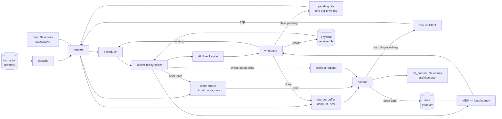

# Area efficient scalar OoO

An area efficient scalar OoO model: a 1-wide out-of-order machine with a unified
physical register file, a separate scheduler, a store queue, and an R10000-style
committed rename map. This document is written to be sufficient to explain the
machine, to simulate it cycle-accurately, or to implement it as RTL.

It has been implemented in Verilog and checked against an independently written
in-order reference over a differential corpus; §18 reports what that measured.

---

## 1. The machine in one page

For illustration we assume support for just `ADD`, `ADDI`, `LW`, `SW` and `BLT`.
Everything structural below is independent of that choice; §2 marks what is
illustration and what is mechanism.

One instruction per cycle through every stage. It is genuinely out-of-order:
instructions execute past stalled older ones, the window fills, and wrong-path
instructions are fetched, renamed, issued and discarded.

Four properties define it:

1. **Values live in one place.** A single physical register file (PRF) holds every
   result. The rename map holds physical register numbers, so an operand *is* a
   register number and readiness is one bit per waiting source. There is no second
   copy of the values and no commit-time transfer between copies.

   There is still an architectural register file in the sense that matters:
   `prf ∘ rat_commit` is exactly one, by construction. `arch_reg(r) =
   prf[rat_commit[r]]` is the architectural value of `r` at every cycle, mid-run,
   with instructions in flight. What the design avoids is *storing* it twice.
2. **The reorder buffer holds status, not data.** A ROB entry is one status bit plus
   the two rename fields commit needs — 12 bits at the example configuration.
   Anything only a minority of instructions needs lives in a structure sized by that
   minority's in-flight population: store addresses and data in a **store queue**,
   the pending control event in a **single register**.
3. **Recovery is one cycle and needs no walk.** A free-list FIFO paired with a
   committed map (`rat_commit`) makes squash-and-restart a bulk copy and a counter
   reset. No checkpoints, no undo log, no recovery state machine.
4. **Redirects are taken at the head of the window,** so recovery is *total* — every
   live entry dies together. That is what lets one bulk operation replace a partial
   unwind, and what lets a single register hold the pending event.

**Wrong-path work happens whenever there is speculation.** Full stop: any machine
that predicts will fetch, rename, issue and discard instructions that should never
have run. Here it is bounded by *when the branch executes*: fetch stops the moment
the first mispredict is detected, at execute. A branch whose operands are ready when
it is dispatched therefore produces **no** wrong-path work at all — it executes the
cycle after dispatch, and issue precedes dispatch. The wrong path is exactly as long
as the branch waited for its operands. (This matters for testing: see §18.)



---

## 2. Instruction set

The five instructions below are an illustration — enough to exercise every mechanism
(an ALU op, an immediate op, a long-latency load, a store that must be ordered, and a
branch that mispredicts) without adding cases that teach nothing. What the design
requires of an ISA is only this: at most two source registers and one destination per
instruction, decode yields an opcode class and an immediate, and control transfers are
resolved by a functional unit.

| Instr | Format | opcode | funct3 | funct7 | Semantics |
|---|---|---|---|---|---|
| `ADD rd,rs1,rs2` | R | `0110011` | `000` | `0000000` | `rd = rs1 + rs2` |
| `ADDI rd,rs1,imm` | I | `0010011` | `000` | — | `rd = rs1 + sext(imm)` |
| `LW rd,imm(rs1)` | I | `0000011` | `010` | — | `rd = mem[rs1 + sext(imm)]` |
| `SW rs2,imm(rs1)` | S | `0100011` | `010` | — | `mem[rs1 + sext(imm)] = rs2` |
| `BLT rs1,rs2,imm` | B | `1100011` | `100` | — | `pc += (rs1 <s rs2) ? sext(imm) : 4` |

| Format | Immediate |
|---|---|
| I | `sext(inst[31:20])` |
| S | `sext({inst[31:25], inst[11:7]})` |
| B | `sext({inst[31], inst[7], inst[30:25], inst[11:8], 1'b0})` |

Arithmetic is `XLEN`-bit with wrapping semantics; `BLT`'s comparison is signed.
B-type immediates are always even, and an offset of exactly 0 counts as non-negative.

Decode also produces three predicates, used throughout:

```
uses_rs1(op) = op != ILLEGAL
uses_rs2(op) = op in {ADD, SW, BLT}
writes_rd(op, rd) = op in {ADD, ADDI, LW} && rd != 0
```

**Any other encoding decodes to `ILLEGAL`.** Decode must not trap: decode cannot know
whether it is on the wrong path, and running off a mispredicted branch into garbage is
routine. An `ILLEGAL` allocates a ROB entry like any other, has no sources and no
destination, is routed to the ALU with latency 1, and raises a fault at execute. It
traps only if it reaches the head of the window.

**`x0` needs no special case anywhere.** Writes to `x0` are discarded because
`writes_rd` is false, so the instruction allocates no physical register and never
touches the renamer. Reads resolve through `map[0]`, which is initialised to physical
register 0 and never changes, because `rd == x0` never allocates. Physical register 0
is never in the free list and is never a destination, so it is always ready, and
`prf[0]` is never written and is therefore always zero. Reserving physical register 0
as the permanent home of the architectural zero register is what removes every special
case for it from rename, wakeup and writeback.

---

## 3. Memory

| | Ports |
|---|---|
| Instruction memory | 1 read — fetch, at `pc >> 2` |
| Data memory | 1 read — load execute; 1 write — store commit |

In a real system either or both is a cache; nothing depends on which, only on the port
counts and on the fact that a load's latency is variable and known no earlier than
issue.

**Fetch is bounded.** A `prog_end` register holds the end of the loaded program; fetch
is suppressed when `pc >> 2 >= prog_end`, and the machine is halted when fetch is off
the end *and* the window is empty (which implies the scheduler and store queue are
empty too). Without this the machine fetches whatever follows the program, decodes it
as `ILLEGAL` and traps — so the bound is part of the machine, not of the harness.

**Speculative accesses must never trap.** At execute, if a computed address is
misaligned or out of range, raise a fault against that instruction, return 0 for a
load, and continue. Wrong-path instructions with garbage addresses are expected; in
hardware this is an address-range check feeding the redirect register (§12).

**A faulting instruction that reaches the head of the window takes a trap**, and the
trap suppresses everything else that instruction would have done — in particular a
faulting store never reaches memory, because the fault check precedes the store-queue
pop (§8.1). Because `rat_commit` is the architectural mapping at every cycle,
architectural registers are readable out of a stopped machine with instructions still
in flight behind the trapping one, with no recovery required.

---

## 4. Parameters and widths

These are **parameters, not a configuration**. The values shown are the example used
for the cost arithmetic in §15; the machine is defined for any legal setting, and has
been verified from `ROB_SIZE=2, RS_SIZE=1, SQ_SIZE=1, NPHYS=33` upward.

```
ROB_SIZE = 64      // reorder buffer entries; power of two
RS_SIZE  = 12      // scheduler entries; need not be a power of two
SQ_SIZE  = 8       // store queue entries
NPHYS    = 48      // physical registers
XLEN     = 32      // data and address width
```

The only correctness constraints are `ROB_SIZE` a power of two, `NPHYS >= 33`,
`RS_SIZE >= 1`, `SQ_SIZE >= 1`. Everything else is a performance choice; every
structure stalls dispatch rather than failing when it fills.

**`NPHYS` is independent of `ROB_SIZE`.** `32 + ROB_SIZE` is merely the size at which
dispatch never stalls for a register; it is not required for correctness. Note that
`NPHYS = 33` is legal but not useful: with one spare register the front end stalls for
one almost every cycle, never runs ahead, and does no speculative work at all.

### Derived widths

Derived, never written as literals — a literal silently understates every larger
setting.

| Name | Definition | At the example values |
|---|---|---|
| `PREG_BITS` | `ceil(log2(NPHYS))` | 6 |
| `FREE` | `NPHYS - 32` | 16 |
| `RING_BITS` | `max(1, ceil(log2(FREE)))` | 4 |
| `ALLOC_BITS` | `ceil(log2(FREE + 1))` | 5 |
| `ROB_IDX_BITS` | `log2(ROB_SIZE)` | 6 |
| `COUNT_BITS` | `ceil(log2(ROB_SIZE + 1))` | 7 |
| `SQ_PTR_BITS` | `max(1, ceil(log2(SQ_SIZE)))` | 3 |
| `SQ_CNT_BITS` | `ceil(log2(SQ_SIZE + 1))` | 4 |
| `OP_BITS` | opcode classes | 3 |
| `RD_BITS` | `log2(architectural registers)` | 5 |
| `REM_BITS` | `ceil(log2(max latency + 1))` | 5 |

The `max(1, …)` guards are load-bearing: at the minimum legal `NPHYS = 33`, `FREE` is
1 and a bare `ceil(log2(FREE))` is a zero-width pointer.

Data, addresses and program counters are all `XLEN`. A physical address wider than
`XLEN` is possible in some systems, and lands in exactly one place — the store queue's
address field.

---

## 5. State

The complete register list. Everything is a fixed-size array with a constant bound;
there is no allocation, no dynamic collection, and no loop with a data-dependent trip
count anywhere in the design.

### Values and readiness

| Name | Shape | Width | Bits | Notes |
|---|---|---|---|---|
| `prf` | `[NPHYS]` | `XLEN` | 1536 | The only place a result lives. **2R1W**, write-through. |
| `pending` | `[NPHYS]` | 1 | 48 | Set at rename, cleared at writeback, bulk-cleared on flush. |

### Renaming

| Name | Shape | Width | Bits | Notes |
|---|---|---|---|---|
| `map` | `[32]` | `PREG_BITS` | 192 | Speculative map. **2R1W** + bulk write on flush. |
| `rat_commit` | `[32]` | `PREG_BITS` | 192 | Architectural map. 1 read-modify-write + bulk read on flush. |
| `free` | `[FREE]` | `PREG_BITS` | 96 | Plain FIFO of physical register numbers. |
| `f_head` | scalar | `RING_BITS` | 4 | Pop pointer. The tail is derived. |
| `n_alloc` | scalar | `ALLOC_BITS` | 5 | Renames in flight. |

`map` is read twice, not three times: the two sources. Its *old* value at `rd` is never
read, because the displaced register comes from `rat_commit[rd]` at commit — see §5.1.

### Reorder buffer

| Name | Shape | Width | Bits | Notes |
|---|---|---|---|---|
| `rob_done` | `[ROB_SIZE]` | 1 | 64 | Set at writeback, cleared at dispatch. Bulk-clearable. |
| `rob_rd` | `[ROB_SIZE]` | `RD_BITS` | 320 | Which architectural register it renamed. |
| `rob_dest` | `[ROB_SIZE]` | `PREG_BITS` | 384 | Which physical register it allocated; 0 if none. |
| `commit_idx` | scalar | `ROB_IDX_BITS` | 6 | Oldest live entry. |
| `alloc_idx` | scalar | `ROB_IDX_BITS` | 6 | Next allocation. |
| `count` | scalar | `COUNT_BITS` | 7 | Live entries; distinguishes full from empty. |

**There is no `allocates` bit**: physical register 0 is never allocated, so
`rob_dest[i] != 0` — a `PREG_BITS`-wide OR — is exactly that predicate. The same trick
removes `dest_valid` from the scheduler and from the units.

**There are no `fault` or `mispredicted` bits.** Both are control events, both are
resolved oldest-first, and the redirect register (§12) holds the oldest one. Commit
tests `redirect_valid && redirect_rob_idx == commit_idx` instead of reading two bits per
entry.

**The ROB is written at dispatch and writeback, and read only at commit.** No ROB field
is read at issue; that is why the execute-time fields — opcode, immediate, sources —
live in the scheduler instead.

### 5.1 Why `rob_dest` holds the new register, not the displaced one

What has to be freed is the register the committing instruction *displaced*, so it looks
like the field should be `prev_dest`. It should not. Commit reads `rat_commit[rd]` before
overwriting it, so one read-modify-write of a single map entry yields the register to
push **and** installs the new mapping:

```
free.push(rat_commit[rd]);  rat_commit[rd] = rob_dest[i]
```

Storing `prev_dest` instead would not remove the need for `dest` — the map update still
needs the new register — so it would be `2 × PREG_BITS` per entry to do the same job.

### Scheduler — `RS_SIZE` entries

| Name | Width | Bits/entry |
|---|---|---|
| `rs_valid` | 1 | 1 |
| `rs_rob_idx` | `ROB_IDX_BITS` | 6 |
| `rs_op` | `OP_BITS` | 3 |
| `rs_pred_taken` | 1 | 1 |
| `rs_imm` | `max(XLEN, ILEN)` | 32 |
| `rs_src1_preg` | `PREG_BITS` | 6 |
| `rs_src1_ready` | 1 | 1 |
| `rs_src2_preg` | `PREG_BITS` | 6 |
| `rs_src2_ready` | 1 | 1 |
| `rs_dest_preg` | `PREG_BITS` | 6 |
| | | **63** × 12 = **756 bits** |

The scheduler is not indexed by ROB index, which is why entries carry `rs_rob_idx`.
`unit_of`, `is_load` and `is_store` are not stored — they are a three-gate decode of
`rs_op`.

### 5.2 The scheduler's wide slot

`rs_imm` holds different things for different opcodes:

- `ADDI`, `LW`, `SW`: the sign-extended immediate;
- `BLT`: **the redirect target** — the pc of the *not-predicted* path, computed at
  dispatch. Fetch already computes both `pc + 4` and `pc + imm` in order to pick one;
  the other is exactly where to redirect if the branch is mispredicted;
- `ILLEGAL`: the instruction word, which is what a trap wants to report — hence the
  `max(XLEN, ILEN)` width;
- `ADD`: unused.

So the branch needs **no adder at execute** — it computes only `taken = (src1 <s src2)`
and compares that against `pred_taken` — the pc need not be stored per ROB entry, and
**no per-branch structure is needed anywhere**, because the target occupies a slot the
entry already has.

Widening this slot from immediate-width to `XLEN` costs `(XLEN − IMM_BITS) × RS_SIZE`
and buys the deletion of a branch-target queue sized by in-flight branches. It is not a
smaller version of the same mistake: the scheduler is sized by *dependency depth* and
drains at *issue*, where a per-branch queue would be sized by *in-flight branches* and
drain at *commit*.

The risk the dispatch-time computation creates is a **polarity** bug — storing the
predicted path rather than the not-predicted one. Check exactly that: keep a debug copy
of each instruction's pc and immediate, and at every redirect assert the target equals
`pc + imm` if the branch was actually taken and `pc + 4` if not. Do not put the check at
dispatch, where it would compare a value against itself.

An ISA with `AUIPC`, `JAL`, `JALR` or precise exceptions needs the pc at execute for
every instruction, so the scheduler grows a pc field *alongside* the immediate and the
redirect target moves to execute — `JALR`'s target is `rs1 + imm` and cannot be
precomputed. There is still no per-branch structure, and the growth lands on a structure
sized by dependency depth rather than by the window.

### Store queue — `SQ_SIZE` entries

| Name | Width | Bits/entry |
|---|---|---|
| `sq_rob_idx` | `ROB_IDX_BITS` | 6 |
| `sq_addr` | `XLEN` | 32 |
| `sq_data` | `XLEN` | 32 |
| | | **70** × 8 = 560 bits |

Plus `sq_head` (3) and `sq_count` (4). Total 567.

### Functional units — 2

| Name | Width | Bits/unit |
|---|---|---|
| `busy` | 1 | 1 |
| `remaining` | `REM_BITS` | 5 |
| `rob_idx` | `ROB_IDX_BITS` | 6 |
| `result` | `XLEN` | 32 |
| `dest_preg` | `PREG_BITS` | 6 |
| | | **50** × 2 = 100 |

### Redirect register and front end

| Name | Width | Bits |
|---|---|---|
| `redirect_valid` | 1 | 1 |
| `redirect_rob_idx` | `ROB_IDX_BITS` | 6 |
| `redirect_kind` | 1 | 1 |
| `redirect_payload` | `XLEN` | 32 |
| `pc` | `XLEN` | 32 |
| `fetch_stalled` | 1 | 1 |

`redirect_kind` selects what `redirect_payload` means: a resume pc for a mispredict, a
trap value for a fault. The two are mutually exclusive, so they share one slot.

### Debug and instrumentation — not hardware

Excluded from the cost arithmetic, and listed by name rather than silently omitted:

```
rob_pc, rob_raw, rob_imm       // the trap message and the redirect polarity assertion
rng_state                      // stands in for a memory system that is not modelled
cycle, committed, issued, squashed, mispredicts
stall_rob_full, stall_rs_full, stall_sq_full, stall_preg, stall_overlap
rs_occupancy_max, sq_occupancy_max, in_flight_branch_hist, redirect_age_overrides
```

---

## 6. Reset

Not optional and not inferable — the ownership partition of §16 fails at reset
without it.

```
map[r] = rat_commit[r] = r        for r in 0..32     // phys reg r holds arch reg r
free[k] = 32 + k                  for k in 0..FREE
f_head = 0,  n_alloc = 0
prf[p] = 0,  pending[p] = false   for all p
count = commit_idx = alloc_idx = 0
sq_head = 0, sq_count = 0
redirect_valid = false
rs_valid[e] = false               for all e
units[u].busy = false             for all u
fetch_stalled = false
```

---

## 7. Execution model

Two functional units, each independently busy or free:

| Unit | Handles | Latency |
|---|---|---|
| `ALU` | everything except loads | 1 cycle |
| `MEM` | loads | long and variable, known at issue |

The split is the point; which opcodes fall on which side is illustration. In the model,
load latency is drawn from a seeded PRNG at issue, uniform over a range, so runs are
reproducible. It stands in for a memory system that is not modelled and affects timing
only, never architectural results.

- Issue is **1-wide**: at most one instruction per cycle, into whichever unit it needs,
  and only if that unit is free. A busy `MEM` does not prevent an `ADD` from issuing —
  that is the entire point.
- Each unit is **non-pipelined**: it holds one instruction for its whole latency.
- The result is **computed at issue** — operands are read then, and a load reads memory
  then. The unit merely holds it for the remaining cycles. This models latency without
  modelling datapath internals.
- `remaining` is loaded with the latency `L` at issue and decremented once per cycle in
  the writeback stage. Because issue runs *after* writeback in the same cycle, a unit is
  never decremented in its issue cycle, so an instruction issued in cycle *N* first
  reaches zero — and so writes back — in cycle *N + L*.

**How many units.** At 1-wide issue a separate functional unit earns its keep only if it
is occupied for **more than one cycle**. That is the whole justification for splitting
`MEM` out: a load holds it for many cycles while other instructions keep issuing. A
1-cycle unit can never be the reason another instruction waits, so giving one its own
unit buys nothing and costs a structural hazard plus a unit's worth of state. This
applies to branches: resolving a branch is a signed comparison, one cycle, on the ALU.

### Writeback arbitration

The PRF has one write port, so at most one unit may write back per cycle. Priority is
`MEM > ALU`. A unit that completes but loses arbitration **holds its result and stays
busy**, retrying the next cycle; its `remaining` must not be decremented below zero.
With 1-wide issue this drains and cannot livelock.

**An alternative: split the register file.** The port is contended only because there is
one file. Give loads their own PRF and their own free list, and let rename allocate a
load's destination from the load file and everything else's from the main file. The top
bit of the physical register number says which file to read. Each file then has a single
writer, so a completing load never waits for a port and never has to hold its result —
the arbiter, the priority rule and the holds-at-zero rule all disappear.

The cost lands on the read side: every operand read selects between two files, adding a
mux to register fetch, which is on the issue-to-execute path where delay is expensive.
It also splits capacity — a load-heavy stretch can exhaust the load file while the main
file has registers to spare — so the two must be sized against the class mix rather than
the total.

---

## 8. Per-cycle algorithm

`step()` executes exactly one cycle. Front-end timing is deliberately abstracted away:
fetch, decode, rename and dispatch happen for one instruction in a single cycle. §14 says
what an RTL implementation must preserve.

Evaluate the stages in this order, with a flush pre-empting the rest of the cycle:

**commit → writeback → issue → fetch/decode/rename/dispatch**

Two helpers used throughout:

```
age(x)     = (x - commit_idx) & (ROB_SIZE - 1)      // 0 is oldest
is_live(x) = age(x) < count
```

### 8.1 Commit — at most one instruction

```
flushed = false
if count > 0 && rob_done[commit_idx]:
    i = commit_idx
    event = redirect_valid && redirect_rob_idx == i

    if event && redirect_kind == FAULT:
        TRAP(redirect_payload)                # no memory write, no state update
                                              # arch_reg(r) is readable immediately

    if sq_count > 0 && sq_rob_idx[sq_head] == i:          # this entry is a store
        dmem[sq_addr[sq_head] >> 2] = sq_data[sq_head]
        sq_head = (sq_head + 1) mod SQ_SIZE
        sq_count -= 1

    if rob_dest[i] != 0:                                  # it renamed a destination
        rd = rob_rd[i]
        tail = (f_head + (FREE - n_alloc)) mod FREE
        free[tail] = rat_commit[rd]           # read the displaced register...
        rat_commit[rd] = rob_dest[i]          # ...then install the new one
        n_alloc -= 1

    commit_idx = (i + 1) & (ROB_SIZE - 1)
    count -= 1

    if event && redirect_kind == MISPREDICT:
        FLUSH(redirect_payload)               # §12.1
        flushed = true
```

There is no register file write, no map lookup by content and no PRF read at commit. A
committing store always matches the queue head; assert it.

### 8.2 Writeback — at most one unit

Skipped entirely if `flushed`.

```
for u in units:
    if u.busy && u.remaining > 0: u.remaining -= 1     # guard: a loser holds at 0

winner = MEM if (MEM.busy && MEM.remaining == 0)
    else ALU if (ALU.busy && ALU.remaining == 0)
    else none

if winner u:
    if u.dest_preg != 0:
        prf[u.dest_preg] = u.result
        pending[u.dest_preg] = false
        for e in 0..RS_SIZE:                           # wakeup, 2 x RS_SIZE comparators
            if rs_valid[e]:
                if rs_src1_preg[e] == u.dest_preg: rs_src1_ready[e] = true
                if rs_src2_preg[e] == u.dest_preg: rs_src2_ready[e] = true

    rob_done[u.rob_idx] = true
    u.busy = false
```

Writeback is purely a value operation: it moves a result into the register file, wakes
its consumers, and marks the entry complete. Control events were already recorded at
execute, so nothing here touches the redirect register.

### 8.3 Issue and execute — at most one instruction

Skipped entirely if `flushed`.

```
for e in 0..RS_SIZE:                                   # fixed loop, narrow reads only
    ready[e] = rs_valid[e]
            && rs_src1_ready[e] && rs_src2_ready[e]
            && (!is_load(rs_op[e]) || load_may_issue(rs_rob_idx[e]))
            && !units[unit_of(rs_op[e])].busy

sel = argmin over { e : ready[e] } of age(rs_rob_idx[e])
```

Selecting the oldest ready entry is a minimum-reduction over `RS_SIZE` values of
`ROB_IDX_BITS` bits — a comparator tree, deterministic and starvation-free.

```
if sel exists:
    i = rs_rob_idx[sel]
    a = prf[rs_src1_preg[sel]]                         # the two PRF read ports
    b = prf[rs_src2_preg[sel]]
    u = units[unit_of(rs_op[sel])]

    u.busy = true;  u.rob_idx = i;  u.dest_preg = rs_dest_preg[sel]
    ev = none

    switch rs_op[sel]:
      ADD:   u.result = a + b;                u.remaining = 1
      ADDI:  u.result = a + rs_imm[sel];      u.remaining = 1
      LW:    addr = a + rs_imm[sel]
             if bad(addr): ev = (FAULT, addr);  u.result = 0
             else:                              u.result = dmem[addr >> 2]
             u.remaining = load_latency()
      SW:    addr = a + rs_imm[sel]
             if bad(addr): ev = (FAULT, addr)
             slot = the LIVE store-queue entry whose sq_rob_idx == i     # see below
             sq_addr[slot] = addr;  sq_data[slot] = b
             u.remaining = 1                              # occupies the ALU; dest is 0
      BLT:   taken = (a <s b)
             if taken != rs_pred_taken[sel]: ev = (MISPREDICT, rs_imm[sel])
             u.remaining = 1
      ILLEGAL:
             ev = (FAULT, rs_imm[sel])                    # the instruction word
             u.remaining = 1

    if ev != none:                                        # §12: oldest wins
        if !redirect_valid || age(i) < age(redirect_rob_idx):
            redirect_valid = true;  redirect_rob_idx = i
            redirect_kind  = ev.kind;  redirect_payload = ev.payload
        fetch_stalled = true

    rs_valid[sel] = false
```

**The store-queue lookup must be masked by queue validity**, i.e. searched over
`(sq_head + q) mod SQ_SIZE` for `q` in `0 .. sq_count-1` only. `sq_rob_idx` on an
*invalid* entry still holds a previous tenant's ROB index, and ROB indices are reused
every `ROB_SIZE` dispatches, so an unmasked search can match a dead slot — the address
and data land there and the live entry commits garbage. This is the same reused-storage
hazard as the stale `rob_done` bit; it is easy to miss here because the live entry *is*
present, it just is not the only match.

The lookup is `SQ_SIZE` comparators of `sq_rob_idx` against `rs_rob_idx`. Carrying an
`sq_idx` in the scheduler entry instead would cost `SQ_PTR_BITS × RS_SIZE` flops to save
`SQ_SIZE` comparators — the wrong trade when state is the scarce resource.

**Control events are recorded at execute, not at writeback.** The branch knows its
direction the cycle it executes and nothing consumes the redirect until commit, so there
is no reason to defer it. Recording it here stops fetch strictly earlier — by the unit's
latency plus any cycles it spends waiting for the writeback port — and keeps the redirect
target out of the functional unit, so `result` is `XLEN` and carries only data.

Assert that a unit's `result` is never consumed when `dest_preg == 0`, so that a store
cannot quietly route its data through the unit and leave the store queue untested.

### 8.4 Fetch / decode / rename / dispatch — at most one instruction

Skipped entirely if `flushed`, if `fetch_stalled`, or if `pc >> 2 >= prog_end`.

```
d = decode(imem[pc >> 2])

# stall checks, attributed by first match in this fixed priority
if count == ROB_SIZE:                             stall_rob_full++;  skip
if no e with !rs_valid[e]:                        stall_rs_full++;   skip
if d.op == SW && sq_count == SQ_SIZE:             stall_sq_full++;   skip
if writes_rd(d) && n_alloc == FREE:               stall_preg++;      skip
# also count stall_overlap: cycles where more than one cause applied
```

`stall_overlap` is the number that says whether a side structure was ever the binding
constraint; one cause counted alone never does.

```
i = alloc_idx
e = lowest index with !rs_valid[e]                # fixed priority encoder over RS_SIZE bits

# --- sources
s1 = uses_rs1(d) ? map[d.rs1] : 0
s2 = uses_rs2(d) ? map[d.rs2] : 0

# --- rename
dest = 0
if writes_rd(d):
    dest   = free[f_head]                         # pop; the entry is NOT overwritten
    f_head = (f_head + 1) mod FREE
    n_alloc += 1
    map[d.rd]     = dest
    pending[dest] = true

# --- reorder buffer
rob_done[i] = false                               # without this a reused slot commits before it executes
rob_rd[i]   = d.rd
rob_dest[i] = dest

# --- store queue, in program order
if d.op == SW:
    t = (sq_head + sq_count) mod SQ_SIZE
    sq_rob_idx[t] = i
    sq_count += 1

# --- scheduler
pred_taken = (d.op == BLT) && (d.imm < 0)         # static: backward taken, forward not
rs_valid[e]      = true
rs_rob_idx[e]    = i
rs_op[e]         = d.op
rs_pred_taken[e] = pred_taken
rs_imm[e]        = (d.op == BLT)      ? (pred_taken ? pc + 4 : pc + imm)   # NOT-predicted path
                 : (d.op == ILLEGAL)  ? d.raw
                                      : sext(d.imm)
rs_src1_preg[e] = s1;  rs_src1_ready[e] = !pending[s1]
rs_src2_preg[e] = s2;  rs_src2_ready[e] = !pending[s2]
rs_dest_preg[e] = dest

# --- front end
pc = (d.op == BLT && pred_taken) ? pc + imm : pc + 4
alloc_idx = (i + 1) & (ROB_SIZE - 1)
count += 1
```

Branch prediction is static: **taken if the offset is negative (backward), not taken if
non-negative**. The target is `pc + imm`, known at decode, so no branch target buffer
exists. Any direction predictor drops in here unchanged; only `pred_taken` comes from it.

Two details that are easy to get wrong:

- **Unused source slots get `preg = 0`**, which is permanently ready and never pending,
  so they can never block issue and a wakeup broadcast can never spuriously match them.
  `ADDI`'s `rs2` field is immediate bits, not a register number; `uses_rs2` is what
  prevents it from being treated as a source.
- **`rob_done[i]` must be cleared here.** ROB entries are reused, and a stale done bit
  lets a slot commit before its instruction has executed.

---

## 9. Renaming

Two structures, both conventional. This is the MIPS R10000 arrangement, and it is
deliberately the boring one.

### 9.1 The free list

A plain FIFO of physical register numbers. Rename pops the head; commit pushes, at the
derived tail, the register the committing instruction displaced. The tail needs no state:
free entries are always `FREE - n_alloc`, so `tail = (f_head + FREE - n_alloc) mod FREE`.

**Rename never modifies the array — it only moves the head.** Commit is the array's only
writer, and it writes exactly the slot that is about to rejoin the free region. The
consequence is worth stating precisely, because it is what makes recovery trivial:

> At any moment the array's `FREE` slots hold `FREE` distinct registers — the
> `FREE − n_alloc` in the free region plus, in the slots the head has passed, the
> `n_alloc` destinations of the renames still in flight.

After a total squash those `n_alloc` destinations are free too. So **all** `FREE` slots
are free, and `n_alloc = 0` says exactly that, whatever rotation the head happens to sit
at. Recovery does not need to rewind the head. (A partial recovery — restoring to a point
inside the window rather than to the commit point — would, which is the only reason to
keep the subtractor; see Appendix A.)

### 9.2 The committed map

`rat_commit` holds the architectural mapping. Commit maintains it; a flush bulk-copies it
into the speculative map.

Its second property is worth as much as its first: **`rat_commit` is the architectural
mapping at every cycle**, so `arch_reg(r) = prf[rat_commit[r]]` is correct mid-run with
instructions still in flight. A trap therefore needs no recovery at all — the machine can
stop wherever it likes and its architectural registers are readable.

### 9.3 Why freeing at commit is unconditionally safe

There is no reuse-distance argument and no lifetime analysis. A register enters the free
list only when the instruction that *displaced* it commits. Every reader of that register
is older than the displacing instruction — a younger reader of that architectural
register would have renamed to the new one — so every reader has issued, and read, before
the displacing instruction retires. No pointer-excursion argument, no wrong-path
reasoning, no ABA hazard, and no requirement relating `NPHYS` to `ROB_SIZE`.

What remains is a **capacity** condition, not a correctness one: dispatch of an
instruction that writes a register stalls when `n_alloc == FREE`. No deadlock is possible
— the stall is released by the commit of the oldest allocating instruction, which is not
waiting on anything downstream of dispatch. Larger `NPHYS` buys fewer such stalls and
nothing else; count them and size it against the count.

**`prf` is not touched on flush.** The registers of squashed instructions go back into the
free list and *will* be handed out again, so their stale contents are entirely reachable.
They are safe only because the next allocator writes the register before any consumer can
read — which the `pending` bit enforces.

### 9.4 Alternatives not taken

A **free bitvector** plus a priority encoder has no pointer to reset: the squashed
instructions' destinations must be individually re-marked free, which is `ROB_SIZE ×
NPHYS` of decode on the recovery path. It also costs more flops at these sizes.

A **checkpoint** is a copy of the map plus the free-list head, `32 × PREG_BITS +
RING_BITS` per branch. The argument against them is not a flop count — a handful is
comparable to the free list, committed map and ROB rename fields together. It is that
they only help *partial* recovery, and do nothing for the total flush this machine
performs, which the committed map already recovers in one cycle. They also introduce a
dispatch stall of their own when a branch arrives and none is free.

---

## 10. Operand readiness

At dispatch, `srcK_preg[e] = map[rs]` and `srcK_ready[e] = !pending[map[rs]]`. At issue,
`src_value = prf[srcK_preg[e]]`. That is the entire mechanism: no age comparison, no
stale-tag detection, no fallback path.

**`pending` is one bit per physical register**, indexed rather than searched:

- **set at rename**, when the register is allocated;
- **cleared at writeback**, when its producer writes the value;
- **bulk-cleared on flush**, which is correct because the redirect is taken at the head of
  the window, so every live entry dies and nothing is left in flight. This is the whole
  reason the array needs no per-entry clearing logic.

Indexing by register rather than searching by content also removes a hazard class. The
dispatching instruction's destination comes from the free list, which the ownership
partition (§16) keeps disjoint from everything in `map`, so it can never alias either of
its own sources — there is no ordering constraint between setting `pending[dest]` and
reading `pending[s1]`, `pending[s2]`.

**Wakeup** is separate from readiness: writeback broadcasts the completing register number
to the scheduler, where each entry compares it against both sources and sets the matching
ready bits — `2 × RS_SIZE` comparators. Reading `pending` directly from every scheduler
entry instead would need `2 × RS_SIZE` read ports on the array, which is why the broadcast
exists. Writeback runs before issue in the same cycle, so a consumer can issue in the
cycle its producer writes back.

---

## 11. The store queue and memory ordering

A FIFO in program order. `sq_rob_idx` is written when the entry is **allocated at
dispatch**; `sq_addr` and `sq_data` when the store executes.

**Allocation must be at dispatch, in program order — not at issue.** Otherwise younger
stores take every slot while an older one waits for its operands, and the older store can
never issue to free one: deadlock. If the queue is full, dispatch stalls.

- **Execute** computes `addr = src1 + imm`, reads `src2` for the data, and writes both
  into the entry found by the masked lookup of §8.3.
- **Commit** pops the head when `sq_count > 0 && sq_rob_idx[sq_head] == commit_idx`,
  writing the data to memory — *unless* that entry is trapping, in which case the trap
  suppresses the write (§8.1).
- **Flush** clears the queue entirely, which is correct because every live entry is
  younger than the redirecting instruction.

### Why a queue here and a single register for branches

A per-entry field of width `W` in the reorder buffer costs `W × ROB_SIZE`. The same
information in a side queue of `N` entries costs `(W + ROB_IDX_BITS) × N`, because each
entry must name its owner. Break-even is `N ≈ W × ROB_SIZE / (W + ROB_IDX_BITS)`. Any
instruction class whose in-flight population stays below that belongs in a queue rather
than in a field every entry pays for.

Stores and branches both qualify and look alike — minority classes, each with one wide
value that must outlive the scheduler entry — but they are sized by opposite facts:
**every store's data must eventually reach memory, whereas only one branch's target is
ever consumed**, because the first mispredicting branch to reach the head squashes
everything behind it. So stores need one slot per in-flight instance, and branches need
exactly one register no matter how many are in flight.

**The queue holds data, not a `data_preg`.** Holding a register number would be narrower
per entry, but it would keep a third PRF read port alive at commit, and a read port costs
a substantial fraction of the array it reads (§15). Holding the data kills the port and
takes the PRF to a clean **2R1W**. It is the clearest case in the design of flops being
the wrong unit of account. It also means a store waits for `rs2` before it can execute.

### 11.1 Memory ordering

A load may not issue while any older store is live. Stores write memory only at commit, so
this is exactly the condition under which memory holds every older store's data and no
younger store's. The store queue holds exactly the live stores in program order, so the
oldest live store is its head:

```
load_may_issue(i) = sq_count == 0 || age(sq_rob_idx[sq_head]) > age(i)
```

**One comparison, not a window-wide scan.** Run both formulations in debug builds and
assert they agree every cycle.

There is no address comparison and no forwarding: the rule costs performance and nothing
else. Relaxing it to compare addresses is cheap precisely because the addresses now live
somewhere a comparator can reach — a second reason the queue holds them rather than the
ROB.

---

## 12. The redirect register

There is **one** redirect register, holding the oldest pending control event — a branch
mispredict or a fault. One suffices because only one is ever consumed: whichever
instruction owns it reaches the head first and discards everything behind it.

```
redirect_valid    1
redirect_rob_idx  ROB_IDX_BITS
redirect_kind     1                 // MISPREDICT | FAULT
redirect_payload  XLEN              // mispredict: resume pc.  fault: trap value
```

It is written at **execute** (§8.3) by any instruction that raises an event, under the
rule *oldest wins*. The target needs no storage of its own: dispatch computes it into the
branch's `rs_imm` slot, and execute moves it here.

**The age comparison is required, not defensive.** Two instructions can both raise events,
and execution order is not program order: if a younger one executes first, a plain
assignment leaves its payload in the register and the older one reaches the head to find
the wrong information. It is easy to build a machine that passes most tests without the
comparison, so instrument it — count how often an older event displaces a younger one and
treat a zero count as evidence the rule is untested rather than unnecessary.

Note that with the per-entry `fault` and `mispredicted` bits gone, commit's test
`redirect_valid && redirect_rob_idx == commit_idx` **is** how it decides an event fires;
there is no second source to cross-check against. If that check is wanted back it costs a
debug-only bit per entry, written at execute and compared at commit.

For a fuller trap architecture the register grows by whatever the trap needs — a cause
code, and the faulting pc if the scheduler does not already carry one. All of it is
per-machine state, not per-entry, which is the point.

### 12.1 Flush

The redirect is taken at the head of the window, so **every** live entry is discarded. It
all happens in the one cycle, and writeback, issue and dispatch are skipped that cycle.

```
FLUSH(target):
    count = 0;  alloc_idx = commit_idx
    rs_valid[e] = false            for all e
    units[u].busy = false          for all u      # a long-latency load may be in flight
    sq_count = 0
    pending[p] = false             for all p
    redirect_valid = false
    pc = target
    map = rat_commit                              # 32 x PREG_BITS, one cycle
    n_alloc = 0                                   # §9.1: the whole free list is free again
    fetch_stalled = false
```

**One cycle, no walk, no state machine, and no extra recovery cycles.** A trap does the
same thing and, per §9.2, does not even need to. Redirecting from the middle of the window
instead is possible but gives all of that up; Appendix A measures what it is worth.

The trade is the design's central one. The committed map plus the ROB's `rd` and `dest`
fields cost real state — 896 bits at the example configuration — and what they buy is that
recovery is a bulk operation instead of a sequential one. The alternative is a rename
structure that doubles as an undo log, walked one entry per cycle: cheaper in flops, but
**its cost scales with window depth**, which cancels the reason to build a deep window in
the first place.

---

## 13. Port budget

Per cycle, wide structures only:

| Structure | Reads | Writes |
|---|---|---|
| `prf` | **2** — both operands at issue | 1 — writeback |
| instruction memory | 1 — fetch | 0 |
| data memory | 1 — load execute | 1 — store commit |
| `sq_addr` / `sq_data` | 1 — commit, at the head | 1 — execute |
| `rs_imm` | 1 — issue | 1 — dispatch |

The PRF is a clean **2R1W**, bought by the store queue holding data.

Narrow structures are flop arrays read and written in parallel by construction, with four
exceptions worth naming because they are indexed rather than broadcast:

- **`map`** — two reads (`map[rs1]`, `map[rs2]`) and one write (`map[rd]`) per cycle, all
  at dispatch, plus a 32-wide parallel load on a flush. Recovery and dispatch are mutually
  exclusive, so they share the port.
- **`pending`** — read twice at dispatch, set once at rename, cleared once at writeback,
  bulk-cleared on flush.
- **`free`** — read once at `f_head`, written once at the derived tail. A `FREE`-entry
  register file with one read and one write port, not a CAM.
- **`rat_commit`** — one read-modify-write of a single entry at commit, plus a bulk read
  of all 32 on a flush.

`rs_imm` is `XLEN` wide and is listed as a wide structure for that reason, even though it
lives inside the otherwise-narrow scheduler.

---

## 14. Implementing this as RTL

The four stages are **combinational logic inside one clock cycle**, ordered by data
dependence; all state updates at the clock edge. "Stage order" is a bypass and priority
ordering, not a pipeline. An implementation may pipeline select → operand read → execute,
and may pipeline rename, but must preserve the timing below.

Writing it as one clocked block with blocking assignments makes the distinction
self-enforcing: every required bypass falls out for free, and every optional one has to be
written by hand.

### 14.1 Required intra-cycle visibility

Load-bearing. An implementation that registers any of these is a different machine.

| Producer → consumer | Requirement |
|---|---|
| writeback → issue, `prf` | **Write-through.** A consumer issuing this cycle reads the value written this cycle. Without it, ~70% of programs give wrong results. |
| writeback → issue, wakeup bits | A consumer issues in the cycle its producer writes back. |
| writeback → dispatch, `pending` | A consumer dispatched this cycle sees its producer's bit cleared. |
| dispatch → dispatch, `map` | Both sources read the pre-rename mapping. |
| commit → writeback, `rob_done` | **Not** bypassed: commit runs first, so an instruction commits no earlier than the cycle *after* its writeback. |

### 14.2 Optional bypasses

Consequences of the stage order rather than requirements. Registering them instead is
correct; it only costs cycles.

- **commit → dispatch, `count` and the free list.** A dispatch can take the ROB slot and
  the physical register freed by this cycle's commit. When the free list was empty the
  derived tail equals `f_head`, so commit's push and dispatch's pop hit the same entry —
  that needs a write-through mux on the free-list read port. Measured worth: **+8.8%
  cycles at `NPHYS = 34`, +0.6% at 36, nothing at 40 and above.** It earns its mux only on
  a tight register file.
- **commit → issue, `sq_count` and `commit_idx`.** A load can issue in the cycle the store
  blocking it commits. Age comparisons are unaffected by the `commit_idx` shift, since
  both operands shift equally.

### 14.3 Implementation notes

Instruction and data memory are macros or caches; everything else is flops. `prf` is a 2R1W
register file with write-through, flop-based at small `NPHYS`. `map` and `rat_commit` are
32-entry flop arrays with read muxes, `map` with a 32-wide parallel load. `rob_rd`/
`rob_dest` are read-muxed at `commit_idx`, `rs_imm` at the selected entry, `sq_addr`/
`sq_data` at `sq_head`.

### 14.4 Getting both maps out of flops

The maps are flop arrays for one reason each: `rat_commit` is bulk-read on a flush and
`map` is bulk-written by it. Neither is a small-RAM operation, so on a technology with
cheap single-write multi-read memories — FPGA distributed RAM, say — the whole 384 bits
plus its copy network is stranded in registers.

**Do not copy. Redirect the read instead.** Add a 32×1 flop vector `lv`:

```
lv[r] == 0   the current speculative mapping for r is rat_commit[r]
lv[r] == 1   it is map[r]

rename read:  src_preg = lv[rs] ? map[rs] : rat_commit[rs]
rename write: map[rd] = dest;  lv[rd] = 1
flush:        lv[*] = 0                      // replaces map = rat_commit
```

Behaviour is identical — verified cycle-for-cycle — and `map` and `rat_commit` become
ordinary 1W3R and 1W2R arrays: 3 read ports on `rat_commit` (two sources, plus the
displaced-register read at commit) and 2 on `map`. In a small RAM extra read ports are
replicas, so the pair costs roughly a tenth of the flop version, and rename recovery
becomes a 32-flop bulk clear rather than a 32×`PREG_BITS` parallel copy.

Three properties make it work, none of them obvious:

- **`lv` is never cleared except on flush.** The tempting mistake is to clear `lv[rd]` when
  the last live rename of `r` retires, which would need a `map` read and a compare at
  commit — the exact port the scheme exists to avoid. It is unnecessary: once the last
  rename of `r` commits, `map[r]` and `rat_commit[r]` hold the *same* register, so either
  read is correct. `lv` is monotonic between flushes.
- **No bypass is needed from commit's `rat_commit` write to dispatch's `rat_commit` read**,
  even though commit precedes dispatch in the same cycle and a small RAM reads pre-edge
  contents. Whenever commit writes `rat_commit[r]`, the committing instruction renamed `r`,
  so `lv[r]` is set and dispatch reads `map` instead. The stale read is unreachable.
- **`map` needs no reset**, which matters because distributed RAM usually has no reset
  port. Its contents are don't-care until `lv[r]` is set. Only `rat_commit[r] = r` must be
  initialised, and that can come from the memory's initialisation values.

**The precondition is a single write port on `rat_commit`,** i.e. at most one *allocating*
instruction may commit per cycle — or two allocating to the same architectural register, in
which case the older write is suppressed and the two share a read address. That is free at
1-wide commit and costs about a quarter of the gain at 2-wide (§14.5).

**It does not scale to a wide renamer.** What the scheme saves — the stored bits and the
copy network — is constant in rename width, while read ports grow with it and cost replicas
in RAM exactly as they cost muxes in flops. The two implementations converge as the machine
widens, and past a certain width the interesting structure is the intra-group dependency
bypass rather than the map at all. The asymmetry is also why this is a commit-side trick:
roughly a third of instructions do not allocate, so restricting commit to one allocation per
cycle is nearly free, whereas the same restriction on rename would cost most of the width.

### 14.5 Two-wide commit

Retiring two entries per cycle costs no state and is worth 4–5% of cycles depending on the
restriction. It is the cheapest performance available anywhere in the design; only the ports
and the restrictions are interesting.

Everything commit needs except `rob_done` is written at *dispatch*, so `rd`, `dest` and the
same-register conflict between the two slots can all be computed a cycle ahead and
registered; the next `commit_idx` is known at the end of the current cycle. The two
`rat_commit` reads are then independent muxes and the collision resolves by **write
suppression**, with no read-after-write chain:

```
conflict     = (rd0 == rd1) && dest0 != 0 && dest1 != 0    // precomputed
free.push(0) = ratc_r0
free.push(1) = conflict ? dest0 : ratc_r1                  // precomputed select
write rat_commit[rd0] = dest0   unless conflict            // the younger write wins
write rat_commit[rd1] = dest1
```

Gating `conflict` on both destinations being nonzero is not optional: two non-allocating
instructions both read `rd == 0` from a field that was never written, and an ungated compare
steers slot 1's push to `dest0 = 0` and leaks a register.

**Keeping `rat_commit` single-ported.** If the maps are in small RAMs (§14.4) the second
write port is not available, and the rule that restores it is: **retire two only when at most
one of them allocates, or when both allocate to the same architectural register.** In the
second case the older write is suppressed, so there is still one write; and because the two
slots then share an address, the *read* collapses to one as well. Writing `a0`/`a1` for "this
slot commits and allocates":

```
allow1  = !(dest0 != 0 && dest1 != 0 && rd0 != rd1)
raddr   = a0 ? rd0 : rd1;      rval = rat_commit[raddr]     // ONE read
waddr   = a1 ? rd1 : rd0;      wdata = a1 ? dest1 : dest0   // ONE write
push0   = rval                                              // when a0
push1   = (a0 && a1) ? dest0 : rval                         // when a1
```

`a0` and `a1` must include *whether the slot commits at all*, not merely whether its ROB
entry has a nonzero destination. Gating on `rob_dest != 0` alone steers the write to slot 1's
address on any cycle where only slot 0 retires, which corrupts the map and shows up as a
double-owned register. Everything the condition needs — both destinations, both architectural
registers, both done bits, the store-queue head comparisons — is available early, so the whole
of it registers.

Measured:

| commit rule | ports on `rat_commit` | cycles vs 1-wide |
|---|---|---|
| slot 1 must not allocate | 1R1W | −3.96% |
| at most one allocating | 1R1W | −4.05% |
| **one allocates, or both to the same register** | **1R1W** | **−4.32%** |
| unrestricted | 2R2W | −5.60% |

The relaxation recovers about a fifth of what the second port buys, for a five-bit comparator
and two muxes, and it is the only one of the restricted rules that keeps the RAM
implementation. How much it is worth depends on how often adjacent retiring instructions
target the same architectural register, which is a property of the compiler's register
allocation, so re-measure it on real code.

At most one memory write port is available at commit, so at most one store may retire per
cycle under any of these rules.

### 14.6 Critical path

`commit → writeback → issue → dispatch` in one cycle is a long path. The natural cut
points, in order of how little they cost: pipeline fetch/decode/rename ahead of dispatch
(the model already abstracts this away); pipeline select → operand read → execute, with a
speculative wakeup broadcast so back-to-back dependent issue survives; deepen the ALU —
every consequence of a 1-cycle ALU here is a timing statement, not a correctness one.

---

## 15. Cost

State only, computed from the parameters. Debug and instrumentation fields (§5) are
excluded by name.

| Structure | Bits |
|---|---|
| `prf` (48 × 32) | 1536 |
| `pending` | 48 |
| `map`, `rat_commit` | 384 |
| `free`, `f_head`, `n_alloc` | 105 |
| reorder buffer (64 × 12) | 768 |
| ROB pointers | 19 |
| scheduler (12 × 63) | 756 |
| store queue (8 × 70 + 7) | 567 |
| functional units (2 × 50) | 100 |
| redirect register | 40 |
| `pc`, `fetch_stalled` | 33 |
| **Total** | **4356** |

The number that matters is not the total but the **marginal cost of a window entry**:
`1 + RD_BITS + PREG_BITS` = 12 bits, plus the logarithmic growth of index fields — about
13 in practice. Nothing else scales with the window, because the register file is sized by
rename pressure and the side structures by class density.

### Area

"Bits" is a proxy for area, and at these sizes the proxy breaks. A 48-entry, `XLEN`-wide
read port is `47 × 32 × 2 = 3008 GE` against `1536 × 5 = 7680 GE` for the array itself:
**a read port costs about 40% of the array it reads.** Report both numbers.

Weights, stated as assumptions rather than facts:

```
DFF 5 GE · 2:1 mux 2 GE/bit (so an N:1 mux of W bits ≈ (N−1)·W·2)
equality comparator 2 GE/bit · adder 5 GE/bit · random 2-input gate 1 GE
```

Enumerating flops, read muxes, write decoders, comparators and adders per structure gives
roughly **35,000 GE** at the example configuration, about 62% of it flops, dominated by
`prf` (≈14,000), the reorder buffer (≈5,600), the scheduler (≈4,800), the store queue
(≈3,900) and the two maps (≈3,400).

This assumes a flop-based register file built from standard cells. **A latch array with
shared read decoders would change the port arithmetic substantially, and that is the single
biggest source of error in the estimate.** Every gate-equivalent figure here is
low-confidence; an implementation's own area report is the authority.

---

## 16. Invariants

Check every cycle in debug builds. Everything except the last is a safety property.

**Pointers and capacity**

1. `count <= ROB_SIZE` and `alloc_idx == (commit_idx + count) & (ROB_SIZE - 1)`.
2. `n_alloc` equals the number of live ROB entries with `rob_dest != 0`, and
   `n_alloc <= FREE`. The free list holds exactly `FREE - n_alloc` registers.

**Register ownership**

3. **Ownership is a partition of `0..NPHYS`.** Every physical register is in exactly one of
   three places: named by `rat_commit`, held as `rob_dest` by a live entry, or in the free
   list between the head and the derived tail. Never two, never none. The arithmetic
   closes: `32 + (FREE - n_alloc) + n_alloc = NPHYS`.

   This is by far the most productive check in the design: it catches a leaked or
   double-allocated register on the cycle it happens, and it is what fires first for most
   renaming bugs. Note there is no stronger per-register statement to make — in particular
   a busy unit's destination need *not* be in `map`, because a younger writer of the same
   architectural register may already have replaced it there.
4. `map[0] == rat_commit[0] == 0`, `prf[0] == 0`, `pending[0] == false`.
5. **`map` and `rat_commit` agree on every register no live entry has renamed.** This
   catches a missed `rat_commit` update at commit, otherwise silent until a redirect
   restores a stale mapping. Under §14.4 it is conditional on `lv[r]`, since `map` is
   don't-care wherever `lv` is clear.
6. `pending[p]` is set exactly for the registers allocated by a live entry that has not yet
   written back. Equivalently: a busy unit's `dest_preg`, and every valid scheduler entry's
   `rs_dest_preg`, are pending; everything else is not.

**Structures**

7. Every valid scheduler entry names a live, not-done ROB entry, and no two name the same
   one.
8. A busy unit's `rob_idx` is live and not done.
9. The store queue is in program order and holds exactly the live stores: every entry names
   a live ROB entry, ages strictly increase from the head, and a committing store always
   matches the head.
10. If `redirect_valid`, it names a live ROB entry, and no older live entry has executed and
    raised an event.
11. `load_may_issue` in its one-comparison form agrees with a scan over all live stores.

**Writes**

12. Nothing writes memory outside commit; nothing writes `prf` outside writeback.
13. At most one unit writes back per cycle — check with a per-cycle counter, since a bare
    assertion on the single `winner` variable is vacuous.

**Quiescence and recovery**

14. When `count == 0`: `map == rat_commit`, `n_alloc == 0`, no `pending` bit is set, and
    nothing is in flight.
15. After a flush, **all of the above hold in the same cycle**.
16. Every redirect's target equals `pc + imm` if the branch was actually taken and `pc + 4`
    if it was not. Must fire on zero redirects; report how many were checked.

**Liveness**

17. **A watchdog.** Assert that the oldest live ROB entry changes at least once every `K`
    cycles, `K` comfortably above the worst-case load latency. Every structure here can be
    individually consistent while the machine makes no progress: a scheduler entry waiting
    on a wakeup that will never arrive satisfies every invariant above. The watchdog is the
    only thing that catches it, and it catches the whole class rather than one instance.

---

## 17. Simulating and verifying it

### Surface

```
new(program, data, seed)
step()                          // exactly one cycle
run(max_cycles) -> StopReason
arch_reg(r) -> XLEN             // prf[rat_commit[r]]; correct at EVERY cycle
memory(), and the counters
state_bits(), area_estimate()   // per-structure, derived from the parameters
```

`arch_reg` needs no committed-shadow companion and no assertion guarding when it is valid;
that falls out of the committed map. A one-line-per-cycle trace behind a flag: cycle, what
was fetched and renamed, what issued and into which unit, what wrote back, what committed,
and the occupancy of each structure.

### Differential testing

- **An in-order reference interpreter** for the same instructions. **It must not share code
  with the model.** Factoring the semantics into one function both call is tempting and
  quietly destroys the test: a shared semantic bug then passes every differential run, and
  what is left only checks timing.
- **A pinned corpus**: generator seed, program count, length distribution and register
  convention all fixed constants, so the corpus is an artifact rather than a description.
  Bound both sides by **retired instruction count**, not cycles.
- **Latency independence**: run each program under several seeds and assert the
  architectural result is identical. Timing must never change results.
- **A no-stall configuration** (`RS_SIZE = SQ_SIZE = ROB_SIZE`, `NPHYS = 32 + ROB_SIZE`)
  should show zero scheduler, store-queue and register stalls.

### Mutations that must fail

A suite that survives these is not testing the design.

| Mutation | Must produce |
|---|---|
| Remove the PRF write-through | Widespread differential failure. |
| Search the store queue unmasked (§8.3) | Differential failure — stores commit garbage. |
| Drop the redirect age comparison | Differential failure. The one most likely to pass vacuously, which is what the override counter is for. |
| Skip the `pending` bulk-clear on flush | Invariant 6, then deadlock. |
| Forget to clear `rob_done` at dispatch | Invariant 7 — a reused slot commits before it executes. |
| Update `rat_commit` at issue instead of commit | Invariant 3. Will not fail without mispredicts. |
| Allocate store-queue entries at execute | Invariant 9 if issue checks capacity, deadlock if it does not. |
| Drop the `n_alloc < FREE` guard | Invariant 3 — but **vacuous at `NPHYS >= 32 + ROB_SIZE`**, where the free list can never empty. Sweep small `NPHYS`. |

### Non-vacuity counters

Several rules are carried on argument unless a counter proves the tests exercised them:

- an older event displacing a younger one in the redirect register, at least once;
- a store-queue-full stall at the size being shipped;
- registers handed out many times over, and one popped in the same cycle the instruction
  that freed it commits;
- wrong-path instructions issued and squashed, with no architectural trace.

**The last one needs care.** Because fetch stops when the mispredict is *detected*, a
branch whose operands are ready when it is dispatched executes the very next cycle and
produces **zero** wrong-path work — issue precedes dispatch, so nothing gets in. A directed
wrong-path test must make the branch wait, typically on a load. The obvious test — a
mispredicting forward branch followed by several instructions — asserts nothing at all.

### Reading the measurements

- **Report the stall vector as a whole, never one cause alone.** A structure being full is
  not evidence that enlarging it will help, and a structure being idle is not evidence it
  stays idle once something in front of it changes. Removing one stall commonly just moves
  it.
- **Every sizing conclusion is conditional on the memory model.** A machine with one
  outstanding memory access and one with several are different machines and rank window
  sizes differently.
- **Latencies drawn at issue make every sweep seed-sensitive.** Average over several seeds
  and report the spread; a difference below the seed-to-seed spread is not a result.
- If out-of-order completions are near zero, or the window never fills, the machine has
  collapsed into an in-order pipeline. Assert against that directly rather than inferring it
  from IPC.

---

## 18. Measured

From a Verilog implementation at `ROB_SIZE = 16, RS_SIZE = 8, SQ_SIZE = 4, NPHYS = 48`,
against an independently written in-order reference over 12 directed tests and 200
generated programs, with a uniform 3–16 cycle load latency. The corpus is deliberately
memory-heavy (~18% loads, ~16% stores), which inflates the ordering figure below relative
to compiled code.

| | |
|---|---|
| IPC | 0.48 (array-sum loop), ~0.42 (corpus) |
| out-of-order writebacks | 2,120 |
| cycles with no issue at all | 55% |
| cycles with an operand-ready load blocked by a busy `MEM` | 21% |
| cycles with a load blocked by the ordering rule | 24% |
| mispredicts | 162 |
| cycles from mispredict detection to flush | 9.8 average, **13.7% of all cycles** |
| live entries older than the branch at detection | 3.9 average, 71% of them already complete |

Two readings worth carrying forward:

- **The drain is not commit-bandwidth-limited.** Only 3.9 entries stand between the branch
  and the head, but the drain takes 9.8 cycles, because ~29% of them have not completed —
  typically a load still in flight. Committing two entries per cycle costs no state and was
  measured at −5.6% total cycles, but it does not attack the real cause.
- **The memory unit and the ordering rule block issue on comparable numbers of cycles.**
  Both are single-mechanism fixes — a second memory slot, and an address comparison against
  the store queue — and neither is possible to rank from a random corpus.

---

## Appendix A — Early squash and rename rollback

Not part of the design. Implemented and measured because the reasoning for it is sound and
the measurement is the only thing that settles it.

**The idea.** Squash at mispredict *detection* rather than at the head of the window, and
undo the renames of the squashed instructions one per cycle. The argument for it is that the
detect-to-flush drain (§18) is dominated by waiting for an older instruction to *complete* —
usually a load — and early squash does not need it to complete. It needs only the branch's
own outcome. Nothing that speeds up commit can address that.

**What it measured**, on the corpus and configurations of §18, with the relaxed 2-wide
commit of §14.5 as the comparison:

| | ROB=16, RS=8 | ROB=64, RS=12 |
|---|---|---|
| baseline | 11,676 | 11,676 |
| 2-wide commit | −4.32% | −4.33% |
| early squash | **−3.26%** | **−2.91%** |
| both | −7.24% | −6.82% |

Undo walk: 2.1 cycles per squash at ROB=16, 2.5 at ROB=64, ~3% of runtime.

Two readings. The payoff is **smaller than the drain suggests**, because the drain cycles
are not idle — the machine is executing older instructions throughout, and dispatching
correct-path work earlier only converts into cycles if there is issue bandwidth and window
room to absorb it. And **deepening the window makes it worse**, which is the signature of a
machine that is memory-limited rather than window-limited. What does hold is that the two
mechanisms attack different things and compose almost additively.

**What it costs in structure.**

- `rob_prev_dest`, `PREG_BITS` per ROB entry — the displaced mapping, which commit does not
  need (§5.1) and rollback does.
- **A third rename-side map read.** `prev_dest` is the pre-rename mapping of `rd`, so under
  §14.4 it is `lv[rd] ? map[rd] : rat_commit[rd]`: `map` becomes 1W3R and `rat_commit` 1W4R.
- The free-list head rewind stops being a no-op (§9.1).
- A multi-cycle recovery, and with it a genuine partway state — see below.

**Where the races are**, which is the real reason to be wary of it. Each of these is a way
for two ends of the machine to disagree about the same cycle:

1. **Commit must not retire past the surviving branch while a walk is pending.** Once the
   branch itself retires, `commit_idx` lands on a wrong-path entry that may already be
   `rob_done`, and commit retires it. Silent architectural corruption. The fix is one
   comparison, but it means the commit stage has to know about a rollback happening at the
   other end of the window. This was found by measurement, not by inspection.
2. **`pending` has a partway state.** Between the squash and the end of the walk, a squashed
   destination is owned by a live-but-doomed ROB entry and is in flight nowhere. Invariant 6
   must be relaxed across the walk. Ownership (invariant 3) still holds throughout, which is
   what makes the state safe rather than merely tolerated.
3. **An older branch can pre-empt a walk in progress.** Its detection must move the walk's
   stop point earlier and re-redirect the pc. A younger one cannot, because it was
   invalidated by the first squash — but that is an argument, not a mechanism, and it is
   worth asserting.
4. **Kill by age, not wholesale.** Scheduler entries and busy units younger than the branch
   die; older ones must survive, and the branch's own unit must survive — the comparison is
   strictly greater, not greater-or-equal. Getting that boundary wrong kills the instruction
   whose result the redirect depends on.
5. **A squashed fault must be disarmed.** If the redirect register names an entry younger
   than the branch, it has to be cleared, or a fault that never happens traps at commit.
6. **The walk must run youngest-first.** When two squashed entries rename the same
   architectural register, only that order converges on the right mapping.
7. Two things that happen to work out, and should be checked rather than assumed:
   `f_head -= 1` with `n_alloc -= 1` leaves the derived tail unchanged, so a concurrent
   commit push is unaffected; and under §14.4 the walk writes `map[rd] = prev_dest` and
   leaves `lv[rd]` set, which is correct whether or not an older rename of `r` survives,
   because if none does then `prev_dest` is what `rat_commit[r]` holds anyway.

**Do not widen the walk.** Undoing `k` renames per cycle needs `k` write ports on `map`,
which forecloses §14.4 entirely. It would buy about one cycle per squash: the mean is 2.1 and
over half of all squashes have nothing to undo at all.

**Verdict.** It works, it composes, and it is the only mechanism measured here that attacks
the part of the mispredict cost nothing else can reach. It is also the only thing in the
design with a multi-cycle recovery, and it weakens four properties the rest of the document
leans on — total recovery, no partway state, a no-op free-list rewind, and a two-read
speculative map. Given that the residual after both mechanisms is still a machine waiting on
memory, this is work to do after the memory system is non-blocking, not before.
